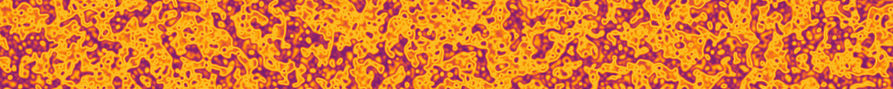

# *Almost* Life-Like
<p class="subtitle">A Probabilistic extension of Conways Game of Life and other life-like automata</p>


## About
This project is an exploration of extending life-like automata to continous states by interpreting
state as a probability. This differs from Smoothlife and Lenia, which use convolution kernel to get
a weighted sum of the neighborhood, then apply a growth function.

The state of each cell is treated as the odds of that cell being alive. The update function 
calculates the odds of there being 0, 1, 2 neighbors alive and so forth. Standard life-like rules
are applied to each discrete state and combined to form next state.

There is a web interface for exploring patterns and rules, a terminal utility for running the model,
saving and loading images, and streaming to FFMPEG to create animations.

A demo page can be found [here](https://willcoffey.github.io/life-like/demo.html) 

## Installation
This project was built for `Deno` but can also be run under `Node` using `tsx`

A build of the web app is included as a vanilla web component which can be viewed in `demo.html` or
by running the dev server.

```
git clone git@github.com:willcoffey/life-like
git submodule update --init
```

### Run or Install via Deno
```
# Run directly
deno run --allow-read --allow-write ./src/terminal-life.ts --help

# Install globally (--config is needed for pngjs dependency)
deno install -g --config ./deno.json --allow-read --allow-write ./src/terminal-life.ts
```

### Run using tsx
```
npm install
npx tsx src/terminal-life.ts --help
```

## Examples
A few example commands to demonstrate the terminal app. Paramters are generally discovered in web 
app which can output command strings for further tweaking via terminal-life.

None of these first examples use an activation function or time smoothing paramter. To me this makes
them the most satisfying since they all collapse back their identical life-like or larger-than-life 
behaviour on discrete states.

Run a known chaotic rule with initial noise on a 200x100 grid for 100 ticks and save the result as
`example_1.png`
```
terminal-life --rule b3456s3456 --reset-random --width 200 --height 100 --ticks 100 --out example_1.png
```
<svg xmlns="http://www.w3.org/2000/svg" viewBox="0 0 80 80" width="320" height="320">
  <image href="./tests/fixtures/example_1.png" width="80" height="80" image-rendering="pixelated"/>
</svg>

----------------------------------------------------------------------------------------------------

It's easy to create animations by streaming raw RGBA frames to FFMPEG. This is Game of Life 
initialized with *almost* alive states. GoL eventually becomes uniform blobs without an activation
function.
<svg xmlns="http://www.w3.org/2000/svg" viewBox="0 0 80 80" width="320" height="320">
  <image href="./tests/fixtures/gol_animation.webp" width="80" height="80" image-rendering="pixelated"/>
</svg>

----------------------------------------------------------------------------------------------------

Most of the standard life-like rules I've looked at look something like the 3 examples below and 
flicker every frame. I've barely scratched exploring the the 262,144 possible rules.
<svg xmlns="http://www.w3.org/2000/svg" viewBox="0 0 80 80" width="320" height="320">
  <image href="./tests/fixtures/b135s23.webp" width="80" height="80" image-rendering="pixelated"/>
</svg>
<svg xmlns="http://www.w3.org/2000/svg" viewBox="0 0 80 80" width="320" height="320">
  <image href="./tests/fixtures/b27s368.webp" width="80" height="80" image-rendering="pixelated"/>
</svg>
<svg xmlns="http://www.w3.org/2000/svg" viewBox="0 0 80 80" width="320" height="320">
  <image href="./tests/fixtures/b46s2358.webp" width="80" height="80" image-rendering="pixelated"/>
</svg>

----------------------------------------------------------------------------------------------------

Larger than life rules make for more visually interesting patterns. Here are some of my favorites,
all generated using the command 
<svg xmlns="http://www.w3.org/2000/svg" viewBox="0 0 80 80" width="320" height="320">
  <image href="./tests/fixtures/r3m1s10-15b14-18m.webp" width="80" height="80" image-rendering="pixelated"/>
</svg>
<svg xmlns="http://www.w3.org/2000/svg" viewBox="0 0 80 80" width="320" height="320">
  <image href="./tests/fixtures/r5m1s23-32b25-30m.webp" width="80" height="80" image-rendering="pixelated"/>
</svg>
<svg xmlns="http://www.w3.org/2000/svg" viewBox="0 0 80 80" width="320" height="320">
  <image href="./tests/fixtures/r2m0s5-9b6-8m.webp" width="80" height="80" image-rendering="pixelated"/>
</svg>

----------------------------------------------------------------------------------------------------

I can also render a phase diagram where the birth and survival ranges of the LtL rule are 
interpolated over. The web interface lets you move and zoom a window into this phase diagram.
This command renders the diagram with a fixed birth/survival range midpoint.
<svg xmlns="http://www.w3.org/2000/svg" viewBox="0 0 80 80" width="320" height="320">
  <image href="./tests/fixtures/r4m1s22-22b25-25m_phase.png" width="80" height="80" image-rendering="pixelated"/>
</svg>

----------------------------------------------------------------------------------------------------

The rest of these examples use time smoothing, an activation function, or both. I like the visual 
patterns more and it's much easier to interpolate over the two activation function parameters but
I also find the math less satisfying. Time smoothing is also usefule for reducing or eliminationg
the flickering of the standard rules.

Heres a phase diagram of conways using the sin activation function. Then the same thing with time
smoothing set to 3.
<svg xmlns="http://www.w3.org/2000/svg" viewBox="0 0 80 80" width="320" height="320">
  <image href="./tests/fixtures/b3s23_sin.webp" width="80" height="80" image-rendering="pixelated"/>
</svg>
<svg xmlns="http://www.w3.org/2000/svg" viewBox="0 0 80 80" width="320" height="320">
  <image href="./tests/fixtures/b3s23_sin_smoothed.webp" width="80" height="80" image-rendering="pixelated"/>
</svg>

----------------------------------------------------------------------------------------------------

Zooming in, I found these waves interesting. 
The commands below create an intial state, a brief animation, advance the state by 10,000 ticks, 
then create another animation. This shows the waves slowly synchronizing over time from theire 
initial random state.
<svg xmlns="http://www.w3.org/2000/svg" viewBox="0 0 80 80" width="320" height="320">
  <image href="./tests/fixtures/waves_initial.webp" width="80" height="80" image-rendering="pixelated"/>
</svg>
<svg xmlns="http://www.w3.org/2000/svg" viewBox="0 0 80 80" width="320" height="320">
  <image href="./tests/fixtures/waves_future.webp" width="80" height="80" image-rendering="pixelated"/>
</svg>

----------------------------------------------------------------------------------------------------

```
terminal-life --width 400 --height 200 --rule b3s23 --activation sin --theme managua --ticks 200 --phase --stream \
```

## The Algorithm
The basic algorithm just uses life-like rules with state values treated as a probability between 
0 and 1 inclusive. I've added additional parameters such as time step smoothing, larger neighborhood
size, and activation functions, but the main point of difference between this and other things like
Lenia and Smoothlife is the probability aspect. These rules cannot be reproduced via convolution 
kernel + growth function. The PMF must be calculated.

The next cell state is calculated by determining the odds for each possible neighborhood state; 1 
alive neighbor, 2 alive neighbors and so forth; and adding up all the probabilities for states where 
the cell would be alive.

In pseudocode
```
state = 0
for(let i=0;i<odds.length;i++) {
    // Where i is the number of alive neighbors and odds[i] is the probability of that state given
    // the cell's neighbors

    // Odds this cell is alive and would survive for this state
    state += cellState * applySurviveRule(i) * odds[i]
    // Odds this cell is dead, but would become alive for this state
    state += (1-cellState) * applyBirthRule(i) * odds[i]
e
```
`odds` is an array 0..N where the value at each index is the probability of that number of neighbors
being alive. It is computed using the direct convolution method for solving Poisson binomial 
distributions.

Additional, optional parameters include larger than life neighborhoods, an activation function and 
time step smoothing where:

 - neighborhood : a Moore or disc neighborhood with radius r
 - activation : $f: [0, 1] \to [0, 1]$
 - time smoothing : Reduces the amount that an update applies to a state. Essentially `state = state + change / smoothing`


A property of this approach is that if you have no time step smoothing, and the activation 
function satisfies f(0) = 0 and f(1) = 1 then if you seed the grid with only 0 or 1 values, then it
simply follows the life-like or larger-than-life discrete rules. You only get continuous behaviour
when you introduce a continuous value.

Pains have been taken to keep the output deterministic. This means limiting computation to the CPU
to avoid GPU floating point differences.

## Web App
The web app is a vanilla-web-component and is bundled with the repo. It can be
viewed by opening the `demo.html` in the root of the repo. It can also be hosted via a vite dev 
server targeting `index.html` via `deno task dev`

## Terminal Utility
The terminal utility can be used to load, generate, and run the automata as well
as pipe raw data for use in pipelines with `ffmpeg` or other tools. For 
additional details see `terminal-life -h` and the Examples section for basic 
usage.

For loading PNGs, cell state is loaded from the image data but the round trip is lossy. Only
about 8 bits can be recovered from the RGBA values per cell. Additionally, if sharing PNGS some
websites or messengers will strip the `tEXt` blocks which contain the grid paramters. Either ensure
metadata isn't stripped or share seperatly with the `--log-json` option.


The terminal utility is particulary good for LLM Agent usage and long running
scripts. There are more examples in the scripts directory of combining shell
scripts with the terminal utility to perform grid searches in parrallel. For
LLM usage I have had success with these prompts on Claude Opus 4.7. Both in 
Claude code and simply in the Claud.ai web app sandbox.

@TODO

## Parameter Reference
Most options can be discovered through the `terminal -h` help or via the web app interface. However
it is worth noting the parameters that this is meant to explore

- **Rules** : rules are specified in one of two formats. Basic life-like rules can be specified as
a string of the form `b2s23` where the numbers represent how many alive neighors cause a cell to 
become alive or survive. They can be non-contiguous such as `b157s23`. The second format is a larger 
than life format with more options. `b2s23` would be specified as `r1m0s2-3b3-3m` which decodes as

 - `r1` = radius 1 neighborhood
 - `m0` = middle cell excluded from neighborhood
 - `s2-3` = survive between 2 and 3 neighbors alive, inclusive
 - `b3-3` = become alive for values 3-3. note that you still need to specify a range for a single value
 - `m` = A moore nieghborhood, i.e. a square with side length = 2r + 1. The other option is `d` for
        disc.

- **Activation Function** : Available activation functions can be seen in the `shapers.ts` file. If
a new function is added to `shapers.ts` it will become available via toggling in the web app or via
the `--activation` option in the terminal app. Activation functions take two tuning parameters, 
`alpha` and `beta` which are linearly interpolated over in phase diagram mode which is useful for
finding patterns.

- **Time Step Smoothing** : Simple scalar value that dampens the effect of each tick. If any other
value besides 1 then discrete 0 1 values will become continuous. i.e. no classic conways.


## Whats Next?
Honestly I imagine it will be a while before I put more work into this repo. I'm much more 
interested in reversible automata and have some ideas that have more practical potential. This 
project was mostly just because I wasn't satisfied with other continous extensions. I wanted 
something that respected the underlying discrete rules, but provided additional continous state. 
That said the next things I would prioritize, in no particular order, would be

 - Better parameter searching. Perhaps latin hypercube sampling. Move away from the 2D phase 
diagrams which are neat, but arbitrarily force 2D paramter searches. 

 - Optimization. The PMF calculation on larger neighborhoods is very low hanging fruit, tons of 
duplicated work because of neighborhood overlap. GPU shaders would be a massive performance 
improvment but wouldn lose determinism across machines. A perfect use case for using the CPU 
version as an oracle for an agent to create a GPU version. 

 - Fractional rules. This model naturally allows for rules that are 50% Conways and 50% Diomeba and
any other combination of rules. In practice this would become rules where birth and survive values
can be continous values.

 - PNG Support in the web app. Would be fairly simple to add, but I would want to be careful about
codebase splitting. Really `terminal-life` and the web app should share the same PNG library and 
functions. This may mean rolling my own PNG tool, like the hand rolled `tEXt` blocks so code can
be shared between terminal and browser.

 - Command recording. In principle `core.ts` can record all input commands for deterministic replay
by either app or terminal utility. The only update needed would be to combine all the `tick` 
commands from playback into a `tick N` command for all consecutive `tick` commands. In most cases it
should fit into `tEXt` blocks and give a means to verify hashes.

 - Making state complex and switching to probability amplitudes would the most interesting further
extension in my opinion. 
